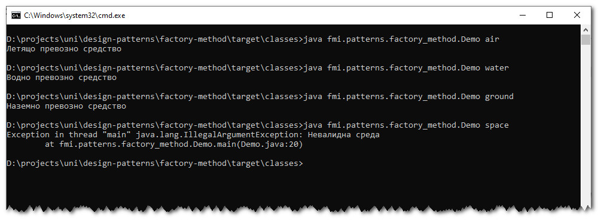

# Шаблон "Метод фабрика"
Примерна имплементация с демонстрация на шаблонът "Метод фабрика".

Примерната имплементация е съпътстващ материал към лекциите по дисциплините "Шаблони за проектиране" и
"Проектиране на софтуер и архитектури".

## Компилиране
`mvn clean compile`

## Стартиране
`$ java fmi.patterns.factory_method.Demo тип_на_средата`

където типа на средата за придвижване може да е:
* `ground`
* `air`
* `water`

## Резултат
