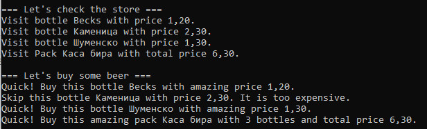

# Шаблон "Посетител"
Примерна имплементация с демонстрация на шаблонът "Посетител".

Примерната имплементация е съпътстващ материал към лекциите по дисциплините "Шаблони за проектиране" и
"Проектиране на софтуер и архитектури".

В тази имплементация е използван [Project Lombok](https://projectlombok.org/), за опростяване на кода и запазването му
в прегледен вид.

## Компилиране
`mvn clean compile`

## Стартиране
`$ java fmi.patterns.visitor.Application`

## Резултат
