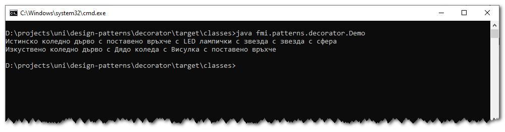

# Шаблон "Декоратор"
Примерна имплементация с демонстрация на шаблонът "Декоратор".

Примерната имплементация е съпътстващ материал към лекциите по дисциплините "Шаблони за проектиране" и
"Проектиране на софтуер и архитектури".

## Компилиране
`$ mvn clean compile`

## Стартиране
`$ java fmi.patterns.decorator.Demo`

## Резултат
