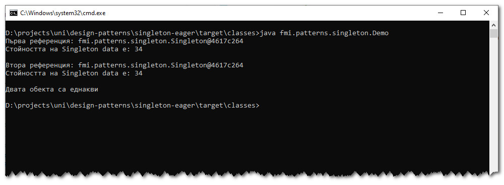
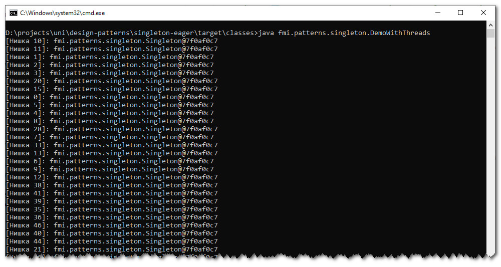

# Шаблон "Singleton"
Примерна имплементация с демонстрация на шаблонът "Singleton" с предварителна инициализация.

Примерната имплементация е съпътстващ материал към лекциите по дисциплините "Шаблони за проектиране" и
"Проектиране на софтуер и архитектури".

## Компилиране
`mvn clean compile`

## Стартиране на примера с една нишка
`$ java fmi.patterns.singleton.Demo`

### Резултат

## Стартиране на примера с две нишки
`$ java fmi.patterns.singleton.DemoWithThreads`

### Резултат
