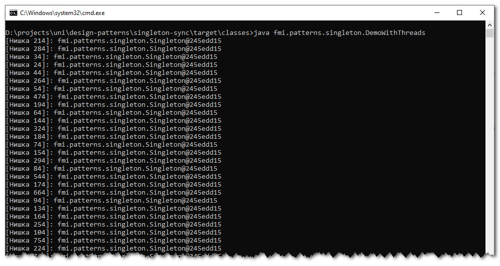

# Шаблон "Singleton"
Примерна имплементация с демонстрация на шаблонът "Singleton" с lazy инициализация и синхронизация.

Примерната имплементация е съпътстващ материал към лекциите по дисциплините "Шаблони за проектиране" и
"Проектиране на софтуер и архитектури".

## Компилиране
`mvn clean compile`

## Стартиране с две нишки
`$ java fmi.patterns.singleton.DemoWithThreads`

## Резултат
