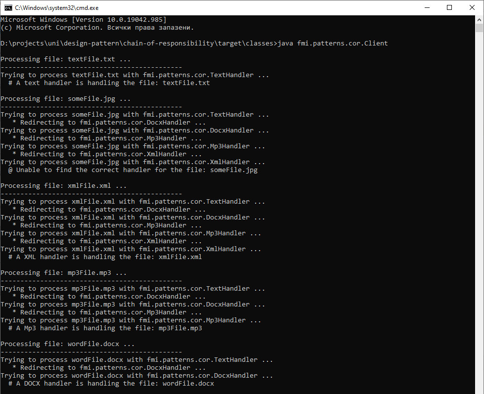

# Шаблон "Верига отговорности"
Примерна имплементация с демонстрация на шаблонът "Верига отговорности".

Примерната имплементация е съпътстващ материал към лекциите по дисциплините "Шаблони за проектиране" и
"Проектиране на софтуер и архитектури".

## Компилиране
`mvn clean compile`

## Стартиране
`$ java fmi.patterns.cor.Client`

## Резултат
