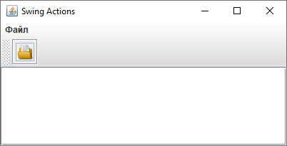
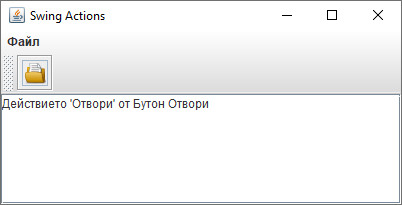
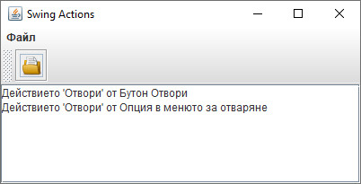

# Шаблон "Команда"
Имплементация на шаблонът "Команда", чрез използване на Swing Actions.

Примерната имплементация е съпътстващ материал към лекциите по дисциплините "Шаблони за проектиране" и
"Проектиране на софтуер и архитектури".

## Компилиране
`mvn clean compile`

## Стартиране
`$ java fmi.patterns.command.SwingActions`

## Резултат

