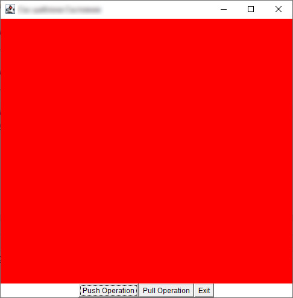
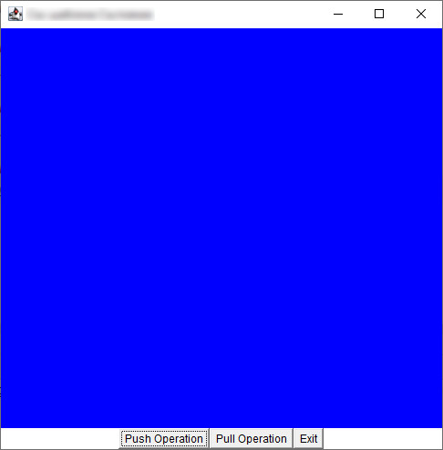

# Шаблон "Състояние"
Примерна имплементация с демонстрация на шаблонът "Състояние".

Примерната имплементация е съпътстващ материал към лекциите по дисциплините "Шаблони за проектиране" и
"Проектиране на софтуер и архитектури".

## Компилиране
`mvn clean compile`

## Стартиране на примера без използване на шаблон
`$ java fmi.patterns.state.no_template.DemoNoSP`

## Стартиране на примера с използване на шаблона
`$ java fmi.patterns.state.with_template.DemoWithSP`

## Резултат и за двата примера

и т.н.