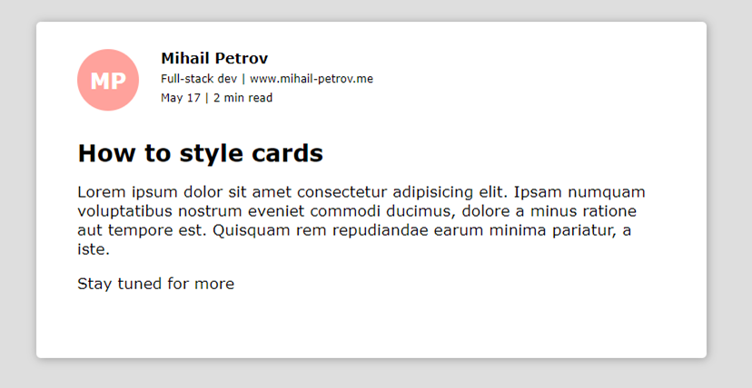
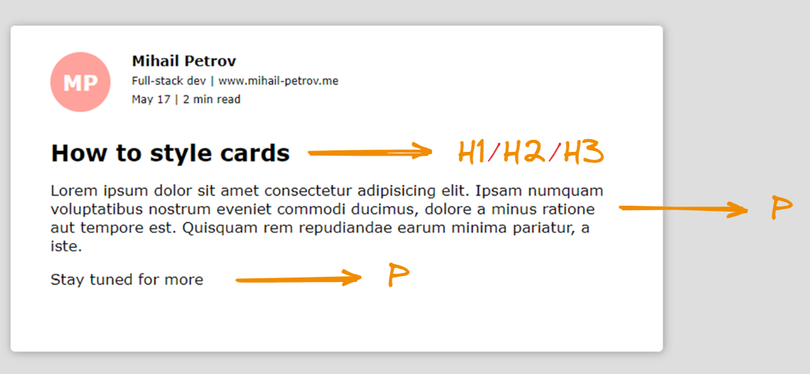
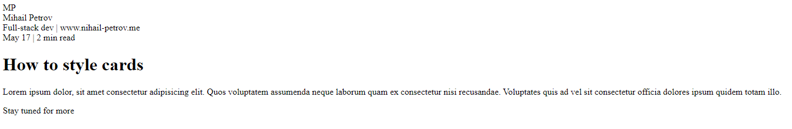
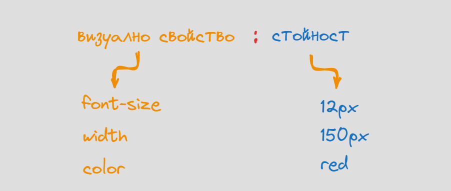

# Основни стилови правила в CSS - част 1

След като вече знаем, как да създаваме HTML документи, както и да ползваме основните структурни елементи, е вече време да превръщаме скучния текст, в красиво и структурирано произведение на изкуството. 

## По какво ще работим ?

Ще започнем с доста базова визуална компонента, която от своя страна ще съдържа всичко необходимо за да симулираме често срещано в уеб приложенията карта със съдръжание. Тази карта може да е пост от социална мрежа, статия или E-mail които съдържа полезна препратка към по голям текст.



Първата ни задача е да създадем подходяща структура на документа който виждаме а след това да го стилизираме с подходящите CSS правила.

## HTML структура на документа

Ще започнем със създаването на базов HTML документ, в които ще налеем съдържанието на контролата. На този етап ще се придържаме към напълно минимална структура на документа. 

```html
<html>
    <head></head>
    <body></body>
</html>
```

Нека да набележим всеки един от елементите, които виждаме в рамките на изображението и да предположим какви ще бъдат подходящите HTML елеменети, които ще съдържат текста или съдържанието. 

Ще започнем с важния въпрос. Къде се намира същинското съдържание на контролата. Всички текстови елементи "живеята" в рамките на определен блок, който в случая можем да дефинираме като обикновен **DIV**


Както вече коментирахме, всеки път когато нямаме кристално ясна идея къде да сложим, нашето съдържание, можем да ползваме **DIV** елемента. Особено ясно си проличава ролята му, като стандартен контейнер за съдържание.

```html
<html>
    <head></head>
    <body>

        <!-- Контейнер за цялата контрола -->
        <div></div>
    </body>
</html>
```

Нека да обърнем внимание на тази част от картата, която показва информация за потребителя, който е създал съдържанието. Тя съдържа следните елементи
- сигнатура (инициали), на потребителя  - **MP**
- Името на потребителя - **Mihail Petrov**
- Допълнителен текст. 

Можем лесно да идентифицираме всеки една от тези елементи, като обикновен текстов контейнер, който също ще дефинираме с **DIV**


```html
<html>
    <head></head>
    <body>

        <!-- Контейнер за цялата контрола -->
        <div>

            <!-- Инфорвация за поста -->
            <div>MP</div>
            <div>Mihail Petrov</div>
            <div>Full-stack dev | www.nihail-petrov.me</div>
            <div>May 17 | 2 min read</div>

        </div>
    </body>
</html>
```

Доста по лесно е да идентифицираме текстовите елементи, които представят основното съдържание в картата като:
- заглавието на статията
- отделните параграфи, от които тя се състоия.



Подобно на стандартен документ, можем лестно да идентифираме подходящите тагове, които са H1/2/3 за 
заглавието и P тагове за отделните параграфи.

```html
<html>
    <head></head>
    <body>

        <!-- Контейнер за цялата контрола -->
        <div>

            <!-- Инфорвация за поста -->
            <div>MP</div>
            <div>Mihail Petrov</div>
            <div>Full-stack dev | www.nihail-petrov.me</div>
            <div>May 17 | 2 min read</div>

            <!-- Заглавие -->
            <h1>Hop to style cards</h1>

            <!-- Параграфи -->
            <p>Lorem ipsum dolor, sit amet consectetur adipisicing elit. Quos voluptatem assumenda neque laborum quam ex consectetur nisi recusandae. Voluptates quis ad vel sit consectetur officia dolores ipsum quidem totam illo.</p>

            <p>Stay tuned for more</p>

        </div>
    </body>
</html>
```

Резултатния документ, които получихме изглежда по следния начин. 



## Първи опити за стилизация

Време е да добавим малко красота към направения документ, като малко по малко въведем концепцията за CSS правила. На кратко, CSS представлява набор от стилови правила, с които можем да кажем на браузъра как да визуализира определен HTML елеменет. Някой от аспектите, коието можем да стилизираме са:
- характеристики на текста и шрифта като цяло;
- цветове и контрасти;
- физически характеристики на елементите - отстояния, височина, широчина;
- позициониране на елементите;
- анимации и визуализации.

За да променим визуалната характеристика на произволен елемент е необходимо да знаем свойството което променяме, както и да му зададем подходяща стойност.



Визуалните свойства са доста повече от представените на примера, но доста често те са групирани или организирани около идеята, която те обслужват. 

### Как можем да стилизираме елементите ?

Най лесния начин да стилизираме даден елемент е като ползваме атрибута **style**, който е наличен в 
рамките на всеки един HTML елемент, който можем да позиционираме в **body-то** на нашия документ.