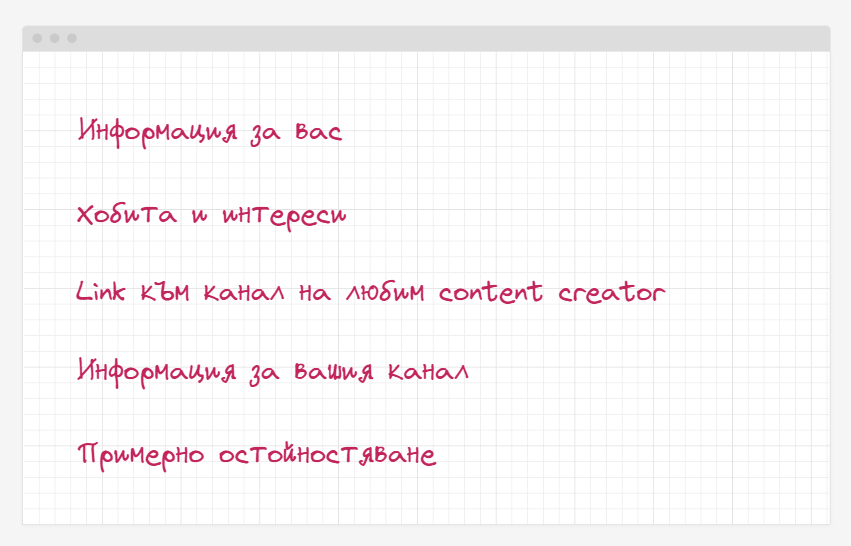
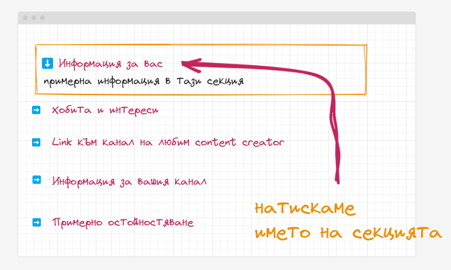
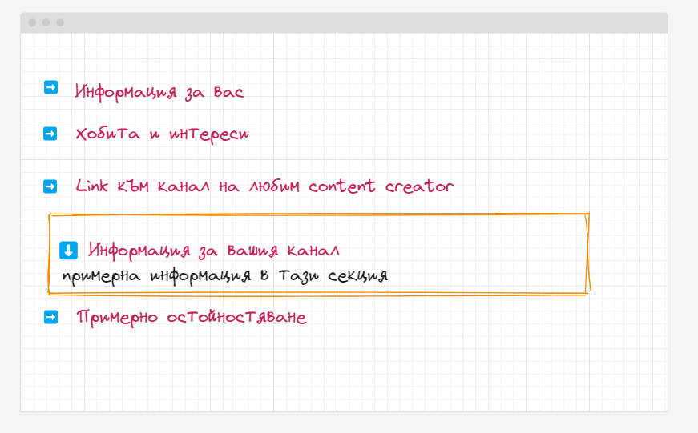

🟦 **Домашна работа 1**
# Скъпи млади инфлуенсъри

### 🚀 Въведение

Младия врабец Борко завършил успешно 8 клас и демонстративно отказал да учи ВиШу. Отворил вестниците за обяви и с мъка установил, че няма, нито желание, нито знания да работи каквото и да е било. Ужасен от собственото си ниво на некомпетентност, той си купил видео камера и започнал смело да се занимава с единственото нещо на този свят, за което не се изисква никакъв специален талант - инфлуенсърство. 

Решен на всичко да покори нови дъна, успешно създал малко китно студио в обкражението на собствения си дом. Създавал си акаунти в социалните мрежи и започнал безпардонно да бълвате безграничната си мъдрост в дигиталната сред своята цифрова аудитория. Няколко мъчителни часа по-късно Борко осъзнал, че все още не е милионер и горчиво заплакал в мазолестите си шепи. Пронизан от стрелата на прозрението и силно смутен от лизинговата техника в дома му - той набързо скалъпил нова бизнес стратегия, която предполагала разработката на така наречения БЛОГ за популяризиране на мъдрите си инфлуенсърски мисли. Разрбал, че в Gitlab ще може да съхравява цялото съдържание на платформата си без да плати нито лев и уверен в уменията си - бързо се спуснал към лаптопа си с желание да твори.

Помогнете на Борко да сбъдне мечтите си.

### 💡 Изисквания към заданието

В рамките на това задание е необходимо да запишете видео, в което да демонстрирате изпълнението на следните задачи:

Демонстрирайте инсталационния процес на следните продукти:
- [VSCode](https://code.visualstudio.com/)
- Инсталирайте част от плъгините които разгледахме в рамките на упражненията
- [NodeJS](https://nodejs.org/en/)
- [Git](https://git-scm.com/)

**Забележка**
Ако някой от продуктите е вече инсталиран на вашата машина, демонстрирайте този факт по най-адекватния възможен начин (**няма нужда да го инсталирате повторно**).

Направете ново GitHub хранилище с название **angular-w1** и го клонирайте локално на вашата файлова система. 
Инсталирайте @angular/cli и генерирайте нов проект, с название hello-world-{ВАШИЯ ФАКУЛТЕТЕН НОМЕР}

В рамките на видеото преминете през структурата на новогенерирания проект и обяснете, с по няколко думи - съдържанието и семантичното значение на отделните функционални файлове и папки.

Модифицирайте, новогенерирания компонент **app.component** така че да визуализира:
- информация за вас;
- информация за вашите хобита и интереси;
- линк към материал на любим content creator, които ви е вдъхновил;
- информация за вашия канал, какво ще правите, как ще го правите и какво да очакват феновете;
- примерно остойностяване на вашите услуги;

Примерна визуализация

### 🪚 Допълнителни задания

Добавете заглавия, към всяка една от информационните секции. Съдържанието в секциите трябва да е предварително скрито и да се визуализира само и единствено при натискане върху секцията. 

В даден момент само една секция може да бъде отворена. 

### 🔥 Критерии за оценяване

<table>
  <tr>
   <td><strong><em>Функционалност</em></strong></td>
   <td><strong><em>Точки</em></strong></td>
  </tr>
  <tr>
   <td>Инсталирайте VSCode</td><td>10</td>
  </tr>
  <tr>
   <td>Инсталирайте Angular плъгините, необходими за разработката</td><td>10</td>
  </tr>  
  <tr>
   <td>Инсталирайте NodeJS</td><td>10</td>
  </tr>
  <tr>
   <td>Инсталирайте Git</td><td>10</td>
  </tr>
  <tr>
   <td>Клонирайте хранилището локално</td><td>10</td>
  </tr>
  <tr>
   <td>Инсталирайте @angular/cli глобално</td><td>10</td>
  </tr>
  <tr>
   <td>Генерирайте нов проект</td><td>10</td>
  </tr>  
  <tr>
   <td>Обяснете характеристиките на файловете и папките  </td><td>10</td>
  </tr>  
  <tr>
   <td>Направете необходимите корекции, в новогенерирания файл </td><td>10</td>
  </tr>
  <tr>
   <td>Качете промените си в GitHub</td>
   <td>10</td>
  </tr>  
  <tr>
   <td>+ Допълнителни задания </td>
   <td>20</td>
  </tr>    
  <tr>
   <td><strong><em>Общо (точки)</em></strong></td>
   <td><strong><em>120</em></strong></td>
  </tr>
</table>

### 🪅 Начин на предаване
Можете да качите, видеото което записахте в новосъздаденото хранилище или да го прикачите в Google Classroom като линк, от вашия собствен Google Drive профил. Изпратете линк към вашето хранилище и видеото като част от домашната. Не забравяйте да натиснете бутона Предай, за да бъде вашето изпращане успешно.