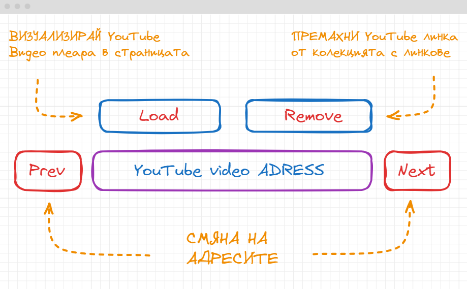
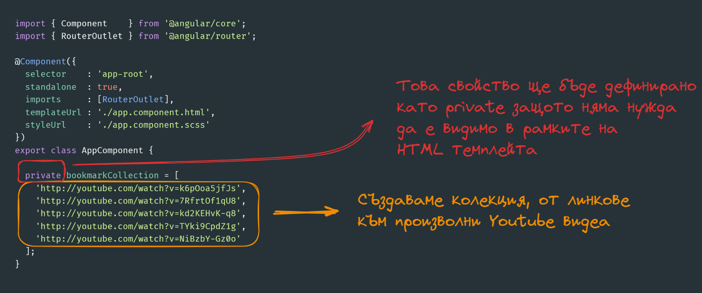
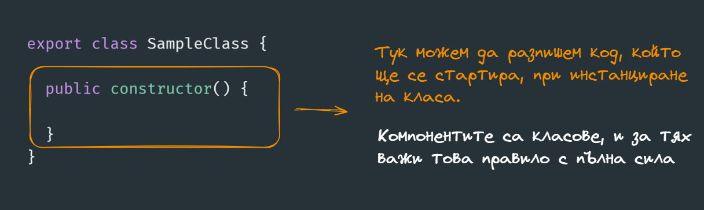
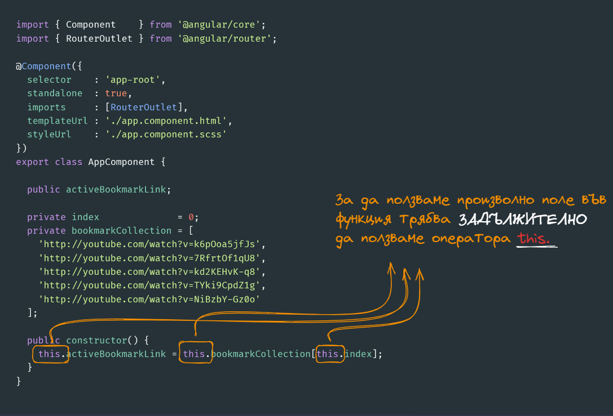
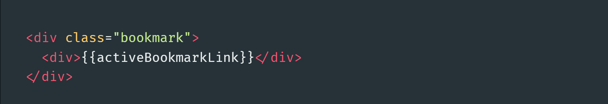
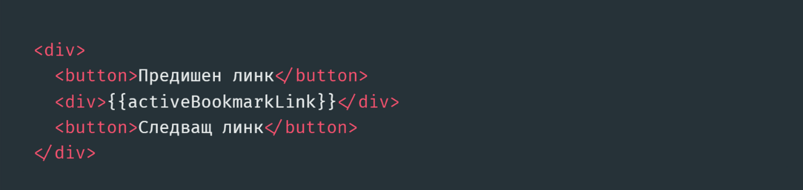
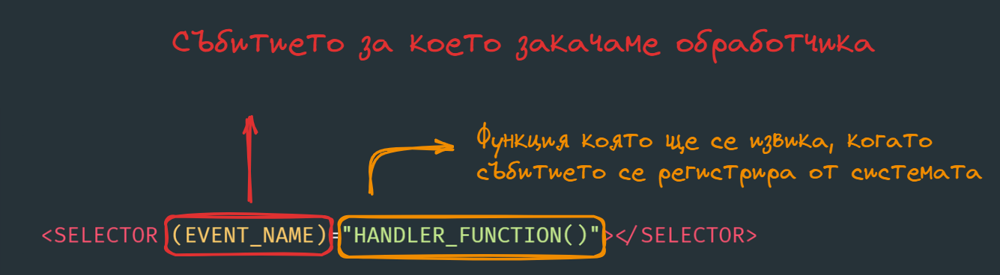
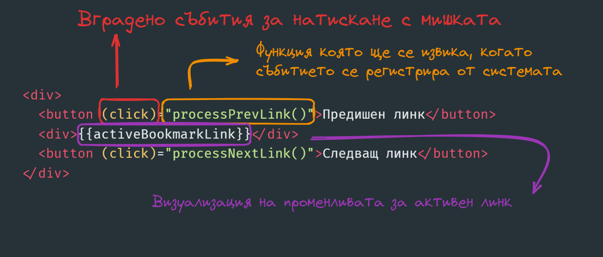
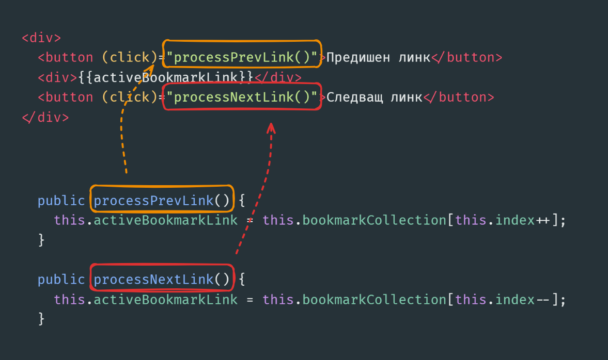
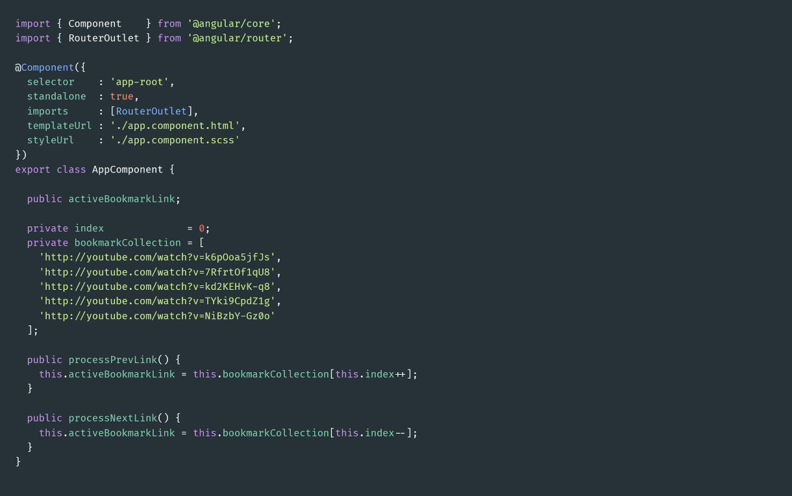

# Среща 2 - Работа с компоненти
 
#### 💡 - Какво разгледахме днес
- Как да свържем компонента с темпейта - CSS и HTML файл
- видимост на полета в TypeScript клас
- работа със събития
- полето $event как да извличаме данни от него
- настройка на TypeScript компилатора

#### 🕹️ - Ресурси и материали
- [Домашна работа](./hw)
- [Сорс код от срещата](./source/)

# По какво ще работим днес

Нека да си разработим базов компоннет, който ще визуализира съдържанието на предварителен списък с YouTUbe видеа. Ще се опитаме да се придържаме към следната схема.

Ще използваме основния компонент **app.component.ts** като отправна точка в нашето приложение. Нека да изтрием всичко от темплейта **app.component.html** и да си създадем в него два бутона и един единствен **div**, в който ще визуализираме - колекцията ни от специални линкове към YouTube видеа.

> 🔥 ВАЖНО
>
> Полетата и функциите декларирани с модификатор за видимост **public** могат да се ползват в рамките на HTML
> темплейта. Всички останали модификатори за видимост, ще доведат до грешка.

Едно от нещата, които ми се иска да направим е в момента в който стартираме нашето приложение, да вземем първия линк от колекцията с видео линкове. За тази цел можем да ползваме конструктора на класа, който ще се изпълни в момента в който компонента стартира. 

Чисто синтактично конструктор в TypeScript клас се декларира, с помоща на ключовата дума **constructor**, по следния начин.

Тоест следвайки същата логика можем да въведем конструктор, в рамките на който да присвоим първия елемент от колекцията **bookmakCollection**.

Вече разгледахме как да визуализираме поле в рамките на HTML темплейта с помоща на оператора за интерпролация. Ще си направим една изключително проста HTML структура, в която да сложим полето **activeBookmarkLink**.

### Добавяне на бутони за предишен и следващ линк

Нека в HTML темплейта - да добавим два бутона за предишен и следващ видео линк, като тяхната функционалност ще се изпълнява при натискането им.

Искаме при натискане на бутона да активираме логика, която да увеличава или намалява индекса на колекцията с линкове с единица. За да се случи това трябва да използваме така наречения механизъм за обработка на събития. 

#### Какво е събития ?
Това е абстракция която вашия браузър разпознава и публично нотифицира всички заинтересовани програмни обекти. Представете си следната аналогио - **УЧИЛИЩЕН ЗВЪНЕЦ** - сигнала на който може да бъде интерпретиран по различен начин в зависимост от фактори като продължителност или тон:
- едно позваняване - край на часа
- две позвънявания - начало на часа
- продължително позваняване - тревога

Събитието е като звънец, което браузъра изпраща на всички JavaScript обекти и ако някой от тях е заинтересова - изпълнява опредлена логика, в този момент. 
HTML елементите могат да генерират събития - например:
- натискането на бутон с мишката - генерира събитие наречено - **CLICK**
- натискане на клавиш от клавиатурата - генерира събитие наречено - **KEY_PRESS** или **INPUT**
- излизането от input поле, след като сме писали нещо - генерира събитие наречено - **BLUR** и т.н.

#### Вградени събития ?
Браузъра ни дава предварителен списък със събития, които са имплементирани на ниво HTML елементи. Всички HTML елементи, които имат някаква функционталност за интеракция с потребителя, вървят със собствен набор от събития. Можете да започните че върху всеси елемент може да се **клика с мишката**.

#### Потребителски събития ?
Доста често ни се налага да дефинираме събития, което да информира дадено парче код че нещо се е случило. Това събитие, обикновенно се генерира от наш или чужд JavaScript код и няма пряка връзка с функционалността на HTML елемент. 

Angular поддържа и двата вида събития, като синтаксиса за деклариране на обработчик на събития от всички видове изглежда по следния начин.

Към бутоните които добавихме ще закачим две функции, които да увеличават и намаляват индекса:
- processPrevLink()
- processNextLink()
И двете функции, ще се активират при натискане на бутона - тоест ще ползваме събитието **click**

И двете функции, трябва да бъдат добавени в TypeScipt класа на компонента. 

Като резултатния код в компонента ще изглежда по следния начин

