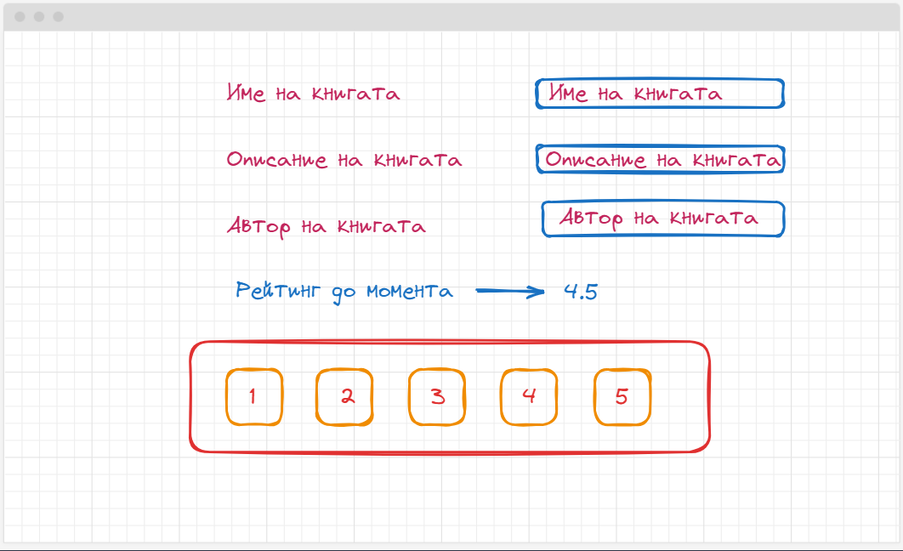
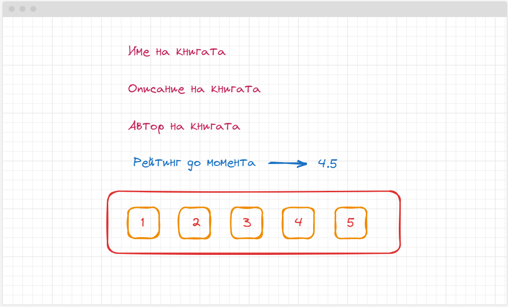
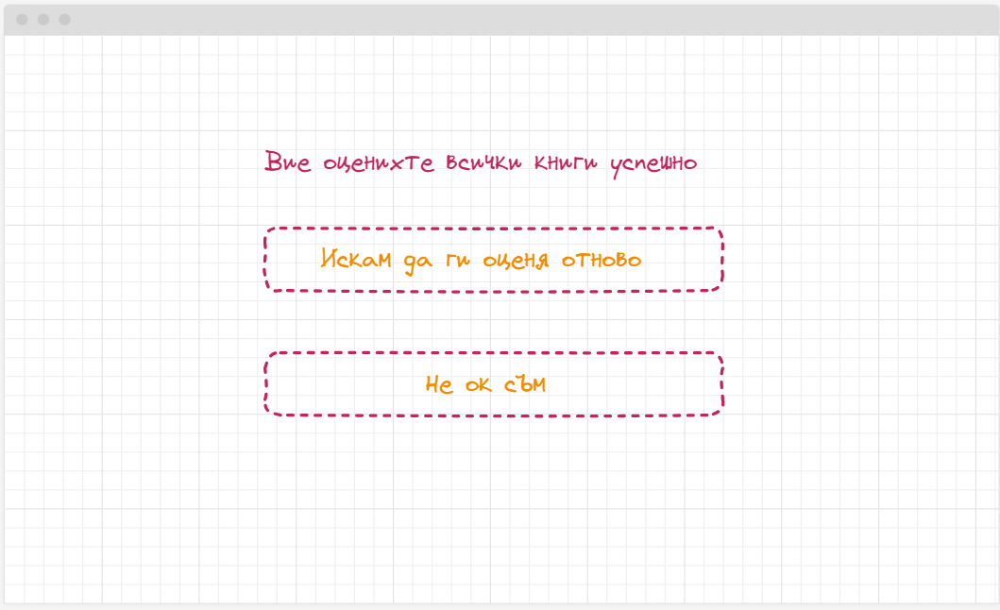

🟦 **Домашна работа 2**
# Книгите, книгите

### 💡 Изисквания към заданието

Да се разработи компонент за оценяване на списък с **ПРЕДВАРИТЕЛНО дефинирани** 5 / 10 книги. Компонента визуализира следните характеристики на книгата:
- Заглавие
- Кратко описание на книгата
- Автор / Автори
- Реитинг

Визуализирайте по една книга в даден момент. Създайте подходящ начин за избор на рейтинг:
- звездички
- бутончета
- input полета

Потребителя избира рейтинга със стойност от 1 до 5. След като потребителя избере рейтинг, той трябва да се визуализира като рейтинг до този момент. Рейтинга до този момент е средно аритметично на всички получени до момента точки (звездички). Една книга може да бъде оцененна многократно от един и същи потребител. Потребителя има възможност да променя имената, съдържанието и авторите на книгата, като техните стойности се променят само и единствено когато книгата е оценена с натискане на бутон. 

След като оцените книга, **системата незабавно преминава към следващата книга**, до момента до който не свършат всички. Когато книгите свършат, компонента започва да ги превърта от начало. 

### 🪚 Допълнителни задания

Модифицирайте компонента, така че след като приключи извъртането на всички книги които трябва да оцените, предоставете възможност на потребителя да избере какво да прави от тук на сетне. Компонента трябва да визуализира два бутона:
- един които да стартира извъртането на колекцията с книги от началото
- другия, които да спира изпълнението на оценяването и извежда съобщение, че работата е свършена успешно. 

### 🔥 Критерии за оценяване

<table>
  <tr>
   <td><strong><em>Функционалност</em></strong></td>
   <td><strong><em>Точки</em></strong></td>
  </tr>
  <tr>
   <td>Създаване на колекция с книги - съдържаща точните полета</td><td>10</td>
  </tr>  
  <tr>
   <td>Визуализация на книгата</td><td>20</td>
  </tr>
  <tr>
   <td>Визуализация на реитингов механизъм за оценка с бутони</td><td>20</td>
  </tr>  
  <tr>
   <td>Функционалност за предвижване на колекцията с книги към следващата книга след оценка</td><td>20</td>
  </tr>
  <tr>
   <td>Редакция на книгите</td><td>20</td>
  </tr>
  <tr>
   <td>Качете промените си в GitHub</td>
   <td>10</td>
  </tr>  
  <tr>
   <td>+ Допълнителни задания </td>
   <td>20</td>
  </tr>    
  <tr>
   <td><strong><em>Общо (точки)</em></strong></td>
   <td><strong><em>120</em></strong></td>
  </tr>
</table>

### 🪅 Начин на предаване
Качете проекта си в хранилище с название **angular-w2**. Предайте линк към хранилището към домашна работа 2 в Google Classroom.