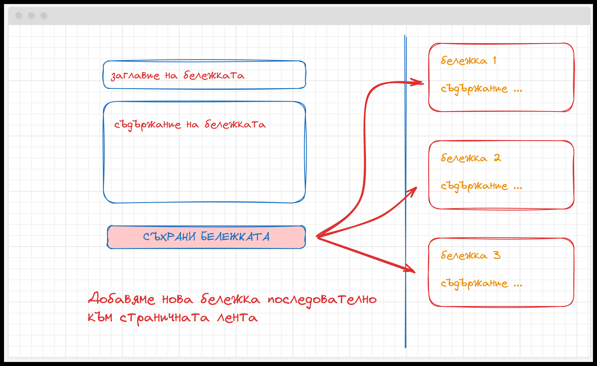
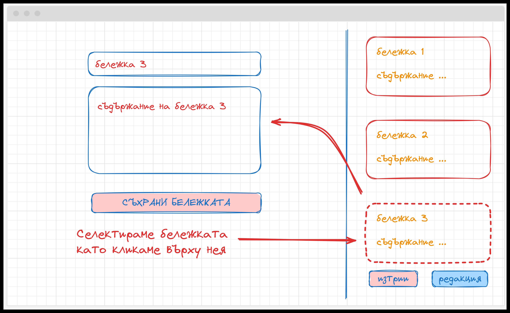
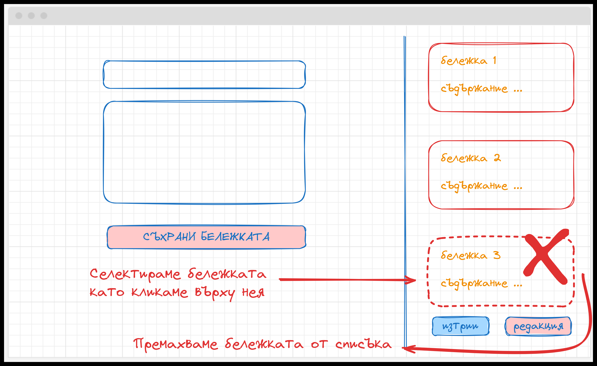
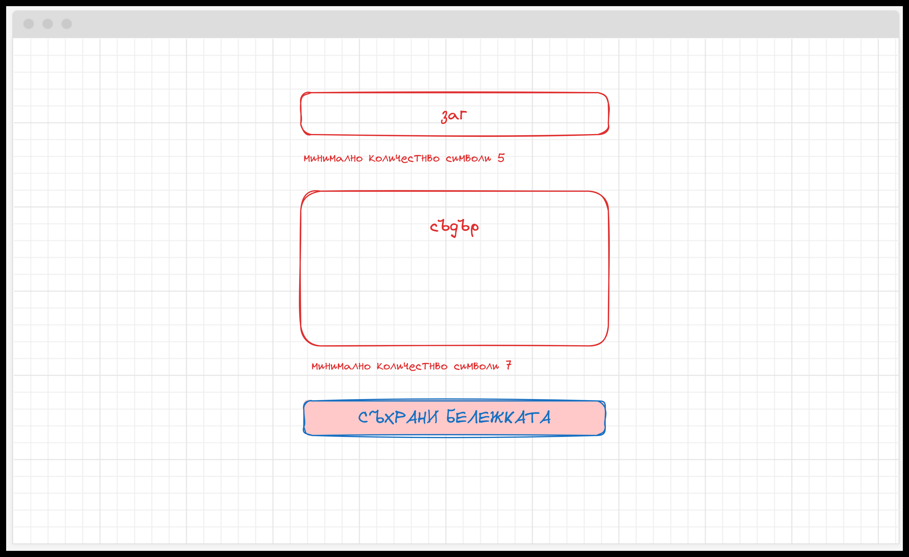

🟦 **Домашна работа 3**
# Тефтер-шън

### 💡 Изисквания към заданието

Да се разработи система за управление на бележки. Приложението трябва да съдържа, полета за:
- въвеждане на заглавието на бележката
- въвеждане на основното съдържание на бележката
- бутон за съхранение на бележката 

Съхранените бележки се визуализират последователно, непосредствено до формата. ( Имате свобода да визуализирате, резултатните бележки и по различен начин).

Всяка една от бележките може да бъде селектирана от потребителя. Селектираната бележка визуализира допълнителни бутони за редакция и изтриване:
При избор на бутон редакция, е необходимо да визуализираме съдържанието на бележката в рамките на формата. При избор на бутон съхрани бележката - трябва да актуализирате съдържанието на вече съществуващата бележка.

При избор на бутон **изтрии**, бележката трябва да бъде премахната от списъка.

### 🪚 Допълнителни задания

В този си вид формата ни за добавяне на бележки е много несигурна, въведете допълнителна функционалност за валидиране на входните данни в рамките на полето за зъглавие и съдържание:
- заглавието трябва да съдържа минимум 5 символа
- съдържание трябва да съдържа минимум 7 символа

Ако налице е грешка визуализирайте рамката на формата с червен цвят + допълнително съобщение, което да информира потребителя че нещо не е наред.

### 🔥 Критерии за оценяване

<table>
  <tr>
   <td><strong><em>Функционалност</em></strong></td>
   <td><strong><em>Точки</em></strong></td>
  </tr>
  <tr>
   <td>Създаване на форма за работа с бележки</td><td>10</td>
  </tr>  
  <tr>
   <td>Добавяне на нова бележка</td><td>20</td>
  </tr>
  <tr>
   <td>Визуализация на вече добавени бележки</td><td>20</td>
  </tr>  
  <tr>
   <td>Изтриване на бележка</td><td>20</td>
  </tr>
  <tr>
   <td>Редактиране на бележка</td><td>20</td>
  </tr>
  <tr>
   <td>Качете промените си в GitHub</td>
   <td>10</td>
  </tr>  
  <tr>
   <td>+ Валидация на входни данни </td>
   <td>10</td>
  </tr>    
  <tr>
   <td>+ Визуализация на червена рамка </td>
   <td>10</td>
  </tr>      
  <tr>
   <td><strong><em>Общо (точки)</em></strong></td>
   <td><strong><em>120</em></strong></td>
  </tr>
</table>

### 🪅 Начин на предаване
Качете проекта си в хранилище с название **angular-w2**. Предайте линк към хранилището към домашна работа 2 в Google Classroom.
