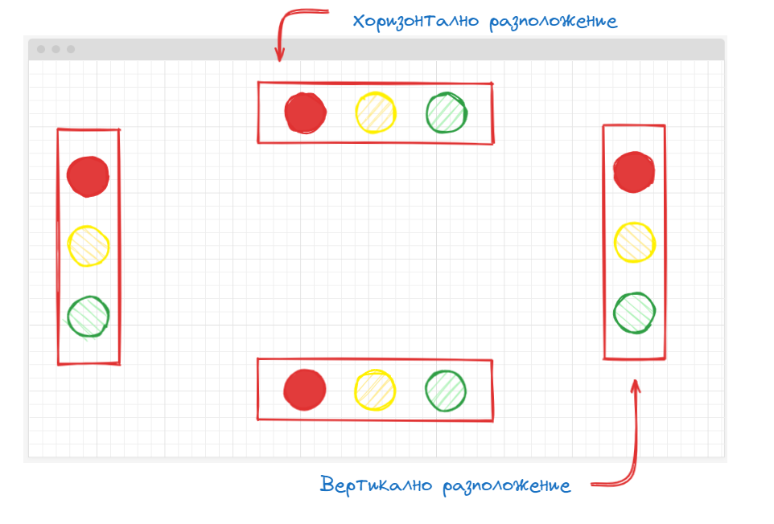
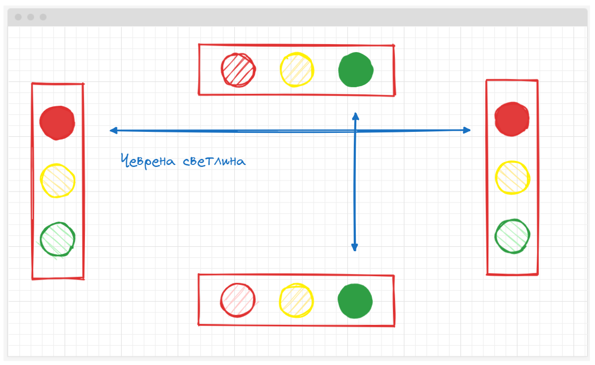
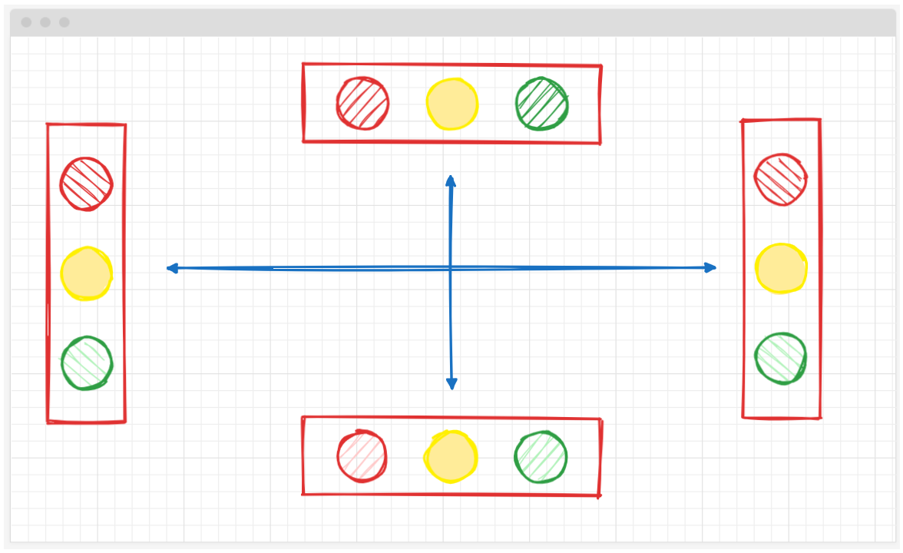
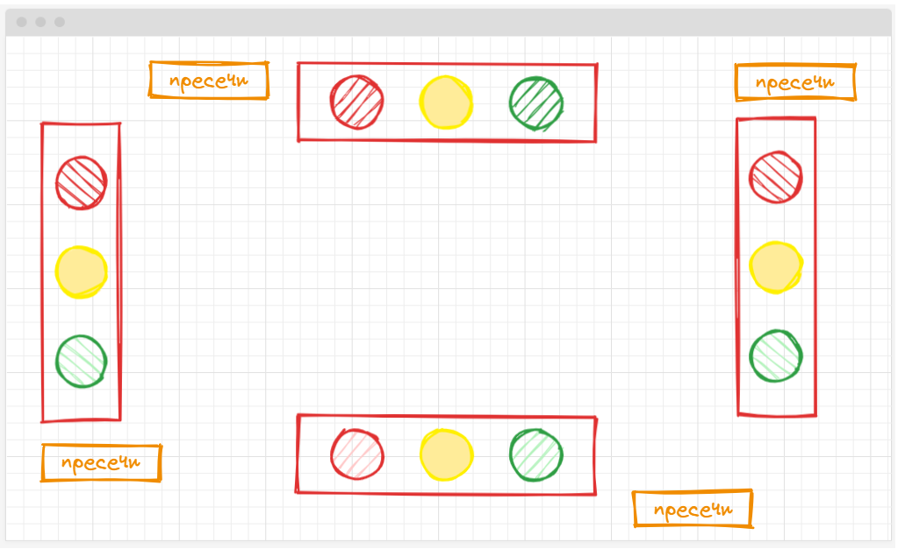
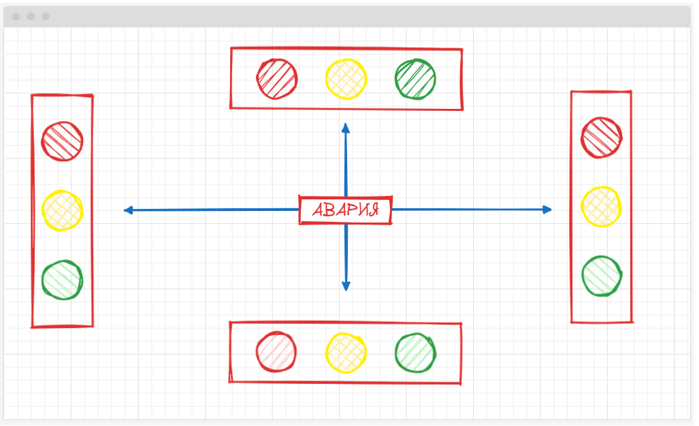

🟦 **Домашна работа 4**
# Неправилно пресичане

### 💡 Изисквания към заданието

Направете проста WEB симулация на кръстовище. На екрана потребителя вижда 4 компонента, наподобяващи светофари на кръстовище - с четири цвята. Сфетофарите трябва да са разположени хоризонтално и вертикално, по начин подобен на описания в илюстрацията.

Светофарите са синхронизирани и показват червено жълто и червено в следната интервал.
- червено   - 5 секунди
- жълто     - 2 секунди
- зелено    - 5 секунди

Спазвайте характеристиките на червената и жълтата светлина. При наличието на червени срещупосожни светофари, задължигелно имаме еквивалентни зелени такива.

При светване на жълта светлина обаче всичко свети в жълто едновременно.

Добавете по един бутон до всеки светофар, озаглавен **пресичане**. Функционалността му е проста:
- Когато кореспондиращия светофар свети в червено бутона е **disabled** и не може да се натиска.
- Когато кореспондиращия светофар свети в жълто и зелено бутона е активен за натискане.

Ако натиснем бутона по време на светещ жулт сигнал - изведете съобщение - неправилно пресичане
Ако натиснете бутона по време на светещ зелен сигнал - пресичате правилно не извеждате нищо на екрана. 

Добавете един голям бутон - Авария. При натискането му всички светофари мигат в жълта светлина, за период от 10 секунди. След като аварията приключи бутона е неактивен за 10 секунди и не може да бъде натиснат.

### 🔥 Критерии за оценяване

<table>
  <tr>
   <td><strong><em>Функционалност</em></strong></td>
   <td><strong><em>Точки</em></strong></td>
  </tr>
  <tr>
   <td>Създаване на компонент светофар и имплементация на неговите характеристики</td><td>30</td>
  </tr>  
  <tr>
   <td>Имплементация на синфронизацията на светофарите</td><td>20</td>
  </tr>
  <tr>
   <td>Имплементация на пресичането</td><td>25</td>
  </tr>  
  <tr>
   <td>Имплементация на аварията</td><td>25</td>
  </tr>
   <td><strong><em>Общо (точки)</em></strong></td>
   <td><strong><em>100</em></strong></td>
  </tr>
</table>

### 🪅 Начин на предаване
Качете проекта си в хранилище с название **angular-w4**. Предайте линк към хранилището към домашна работа 4 в Google Classroom.