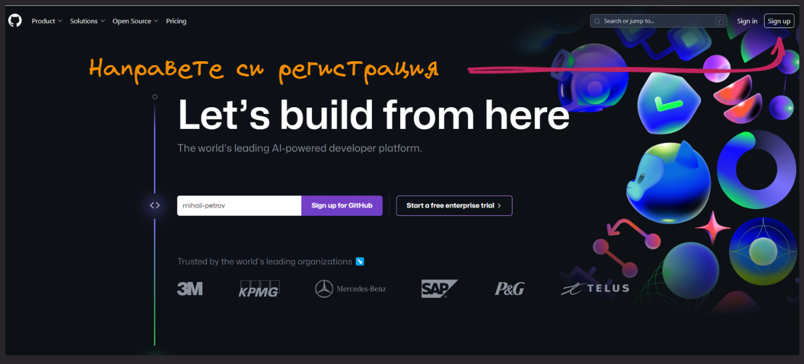
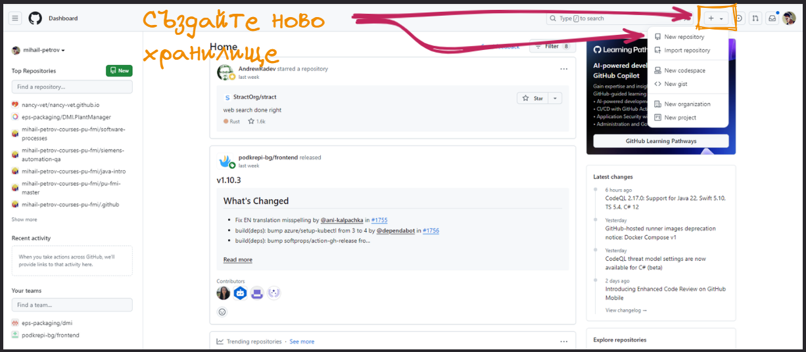
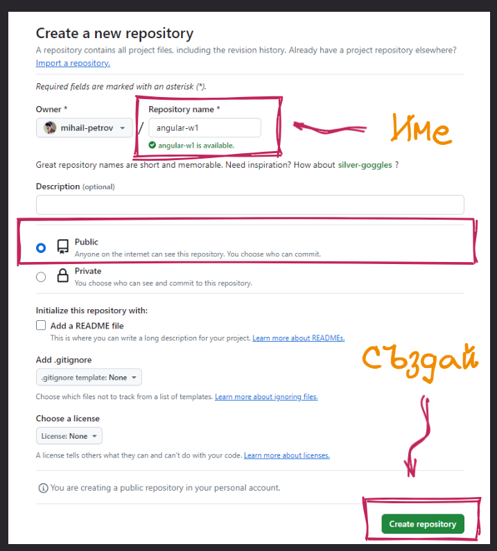
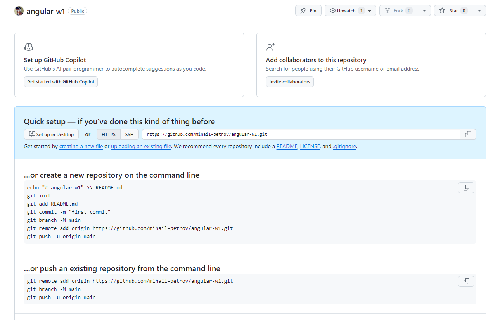
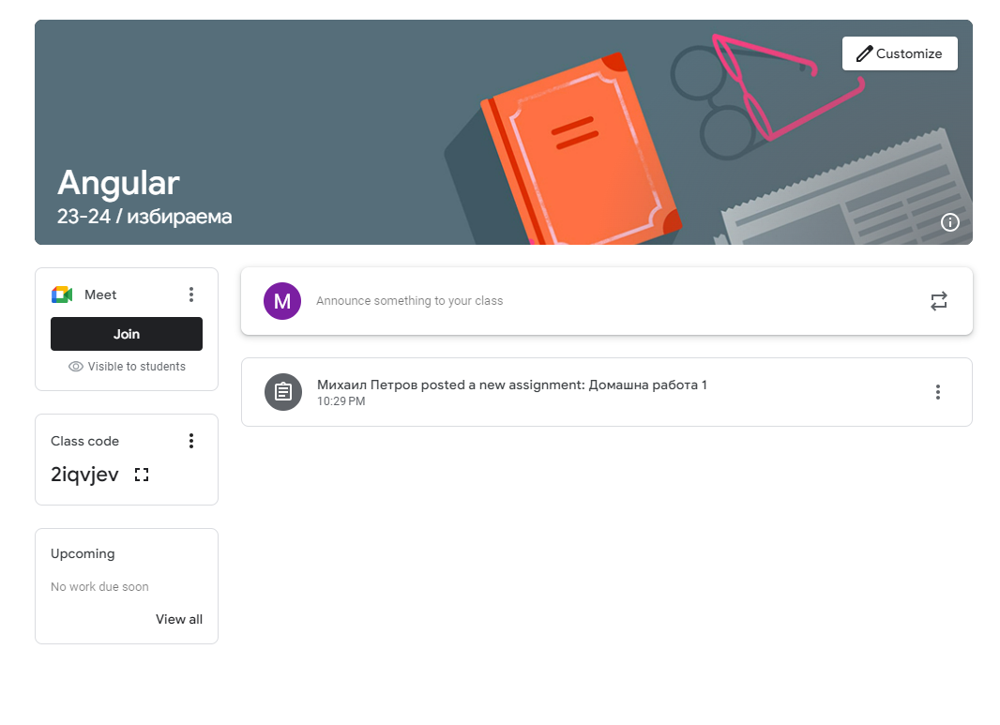
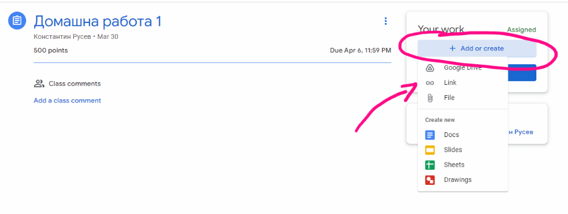

# Работа по домашни и тяхното предаване

За работа по домашните работи студентите имат нужда от регистрация в [GitHub](https://github.com/) - където могат да създават, хранилищата в които ще съхраняват кода си. 

### 🔥 Регистрация в GitHub

Ако нямате профил в платформата, направете си нова регистрация, следвайки стандартните стъпки в сайта на [GitHub](https://github.com/)

Първо ще си създадем ново хранилище

Всяка една домашна работа, която получавате ще има изискване за уникално название на вашето хранилище с цел по лесно групиране и проверка - например - **angular-w1**.

Задължително направете хранилището публично, това значително улеснява проверката.

От тук насетне сте вие, време е за работа по кода

### 🔥 Предаване на домашното в Google Classroom

Всяко едно домашно ще има самостоятелен запис в Google classroom, подобен на този.

За да предадете домашната си работа трябва да изпратите линк към вашето публично хранилище, за да мога да го проверя.

Крайния срок за предаване на всяко домашно е близо две седмици, от неговото публикуване. 