# Наръчник на малкия предприемач

## Подготовка на екипа

Здравейте малки котки, за да успеете уверено да направите първите си крачки в света на големи бизнес е необходимо да подготвите и организирате работната си среда. Резултата от това свято действие ще служи като показно за всички задачи които сте свършили през триместъра. 

В рамките на упражненията ще имате два вида активности, които ще ви носят точки:
- Проекто итерации (отборна работа) - в която ще работите в екипи от 5 човека
- Самостоятелни активности - в които сами ще работите по конкретна задача

И двете дейности ще се случват в контекста на платформата **[GITHUB](https://github.com/)** в която задължително трябва да си направите регистрация. Подробности ще намерите в следващите параграфи.

## 🚀 Проектни итерации
Проектна итерация е период от 2/3 седмици, в които екипа работи по поставените му задачи. Задачите се изпълняват както **самостоятелно** така и **отборно**. Итерацията приключва с публична защита на свършената от вас работа с помощта на **видео записи**. 

### Роли и екипна организация
Всяка екипна ротация се състои в избор на роли, разпределението им и извършването на набор от задачи касаещи тези роли. Ролите, от които можете да си избирате, са както следва 

|Роля|с какво се занимава|
| :- | :- |
|Developer 1|Разработва приложението|
|Developer 2 |Разработва приложението|
|QA|Грижи се за организацията и тестването на приложението|
|Project manager|Грижи се за организиране и разпределяне на задачите, подготовката на итерациите на проекта.|
|Product owner|Грижи се за защитата на продукта следенето на новите функционалности, промяната на съществуващите и отпадането на нерелевантните такива.|

### Работно място
За да осигурим прозрачност на проектната дейност, всеки един от членовете на екипите трябва да разполага със **самостоятелен акаунт** в [GitHub](https://github.com/).

Всеки един от екипите трябва да притежава [организация в GitHub ](https://github.com/account/organizations/new)в която ще публикува прогреса по своята разработка.

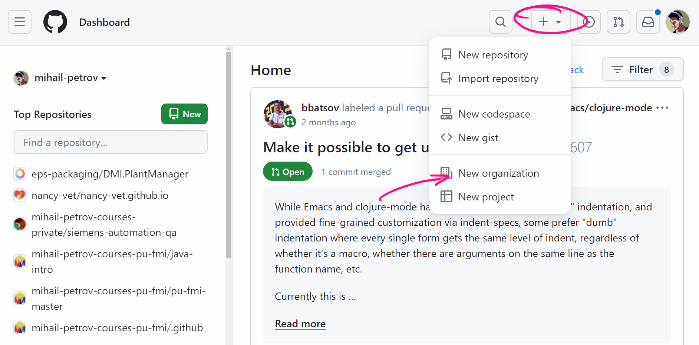

Организацията се създава от **ЕДИН ЧЛЕН** на екипа, като върху неговите плещи лежи нелеката задача да покани всички останали свои колеги, към новосъздадената организация.

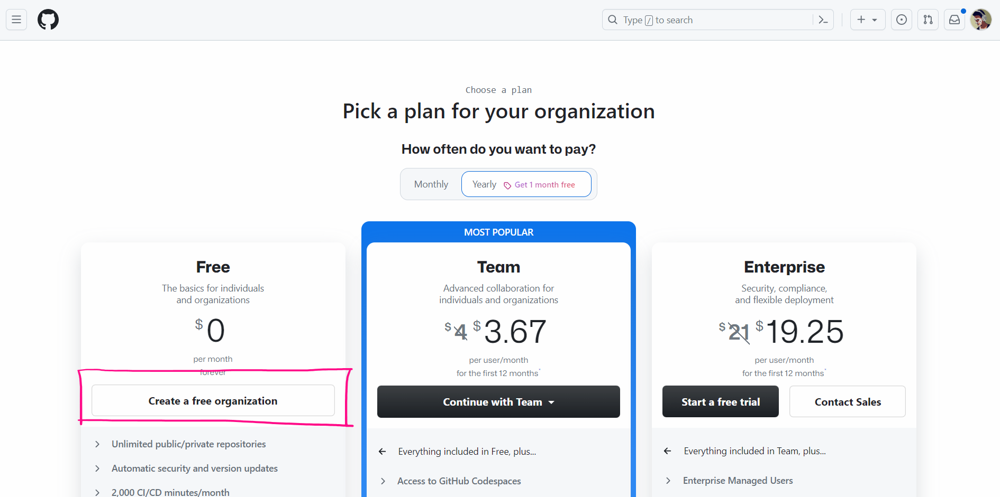

Името на организацията трябва **ЗАДЪЛЖИТЕЛНО** да следва формулата, която е описана в следния шаблон:

**sp-2023-2024**-**{TEAM-NAME}**

Избора ви на име, може да се подчинява само и единствено на вашите принципи, желания и интереси. Подходете с чувство за хумор и бъдете креативни. Но задължително спазвайте следните безкрайно дразнещи правила 

- Името на вашия отбор трябва да се състои от **ДВЕ ДУМИ**
- Името на вашия отбор трябва да бъде на **АНГЛИИСКИ ЕЗИК**
- **ВСЯКА ЕДНА ОТ ДУМИТЕ** името на вашия отбор, трябва да започва с една и съща буква

✅ **Валидни отборни имена:** 

- rapping-rabbits 
- anemic-acrobats 
- satanic-supporters

❎ **Невалидни отборни имена:** 

- rule-brackets 	( **думичките започват с различни букви** )
- invisibility 	( **името на отбора е съставено от една дума** )
- borbeni-batki 	( **името на отбора е на шльокавица** )

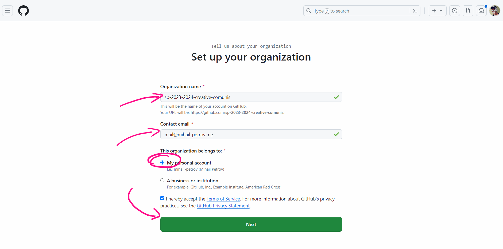

🔥 **Пример:**

Ако екипа ви се казва : Creative Comunist името на вашата организация трябва да бъде 
**sp-2023-2024-creative-comunist**

Студента, който създаде организацията, трябва да покани всички свои съотборници към новореализираното работно пространство.

Организацията трябва **ЗАДЪЛЖИТЕЛНО** да покани ръководителя на курса **mihail-petrov за да може, да има прозрачност по активностите свързани със заданията.**

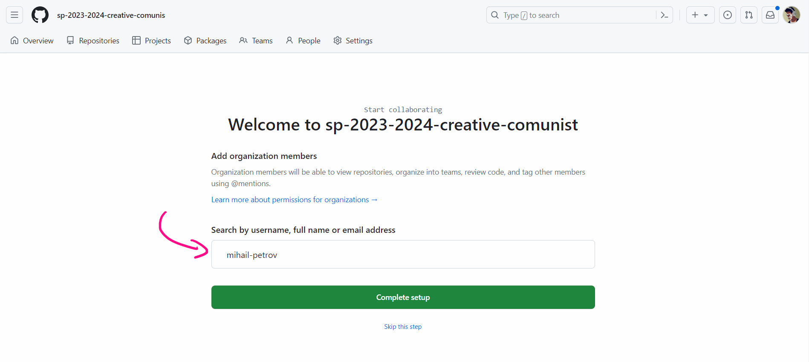

Новосъздадената организация е празна, насочете погледа си към таба Repositories

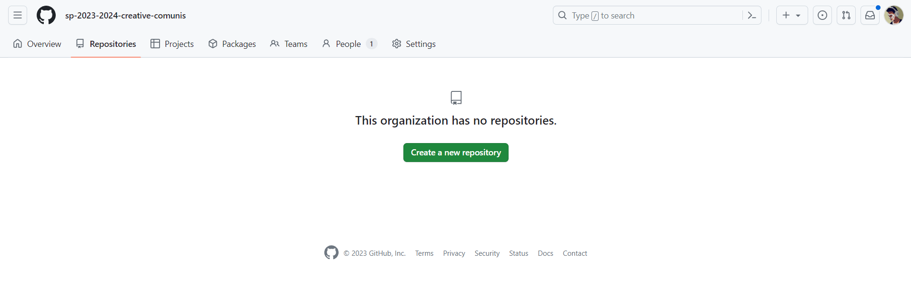

### Работа по проекто итерации и активности
В рамките на програмата, ще получавате задачи, които трябва да изпълнявате както индивидуално така и отборно. 

С цел организиране на проекто итерацията и прозрачност в рамките на целия процес, е необходимо да следвате следните правила за правилно организиране на **GITHUB** репозиторито ви, които ще представим с кратка история в картинки.

Както вече разбрахте ще трябва да се справите с определен набор проекто итерации, в рамките на тази дисциплина те ще бъдат 4 броя. Всяка проекто итерация трябва да "живее" в собствено репозитори. Всеки екип създава репозитори с название **iteration-{n}** където **n** е номера на итерацията, която ви се дава. 

Всички новосъздадени репота трябва да са задължително публични.

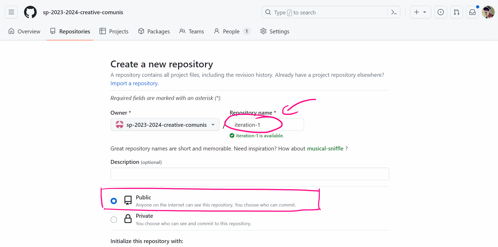

Резултата от операцията, ще бъде чисто новото ви репозитори - готово за активна работа

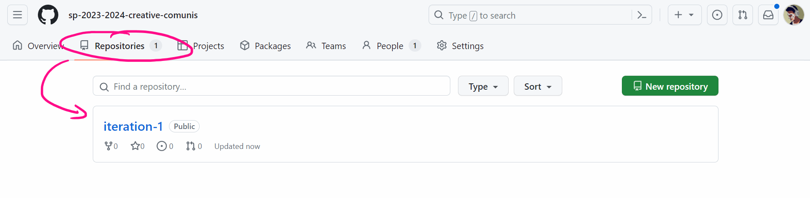

В новосъздаденото репозитори винаги трябва да има следните под папки:
- **team** - съдържа всички документи, имащи отношение към екипната работа
- студентски папки именовани във формат stu{**faculty-number**} - съдържа всичко, което студентите създават като самостоятелна работа

🔥 **Пример:**

Ако в проекта имаме 5 студента със студентски номера:
- Ненчо Кирчев - факултетен номер - 12345671
- Пенчо Начев - факултетен номер -  12345672
- Михаил Петров - факултетен номер -  12345673
- Ангел Георгиев - факултетен номер -  12345674
- Емил Дойчев - факултетен номер -  12345675

директориите в репозиторито ще изглеждат по следния начин

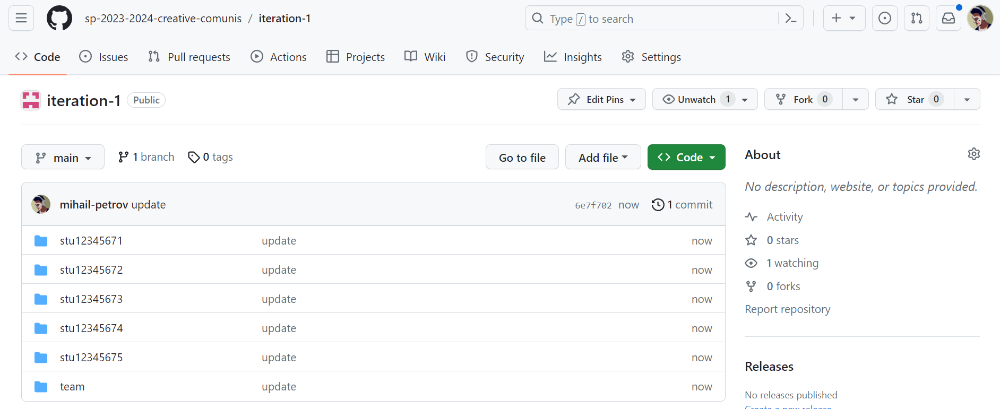

### Избор на роли

В началото на всяка една проекто итерация (**с изключение на първата, която е свързана със сформирането на екипа**), екипа трябва да вземе важно решение, как да разпредели ролите в него. 

Към наръчника е приложен, специален Excel файл, наименуван **[роли], който трябва да отрази желанието на студента и неговата роля.** 

Всяка една от ролите ще има различна активност през отделните итерации на проекта, като вие **като екип имате пълната свобода да ги разпределите както сметнете за редно**, в зависимост от вашите силни и слаби страни. Резултатния файл, позиционирайте в root директорията на репозиторито

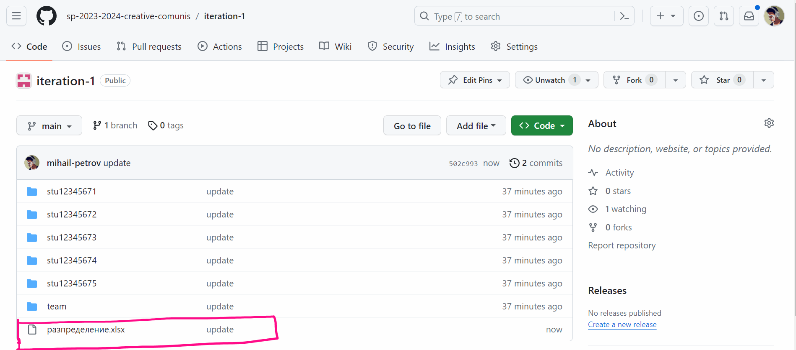

**Всяка итерация изисква определена роля да се поема от различен член на екипа**. Не е позволено повторение на роли от един и същи студент.

### Допълнителни препоръки
Всички проблеми в екипа се решават само и единствено в екипа, преподавателя няма да решава спорове и конфликти, бъдете дипломатични и помнете, че отборната ви работа е една трета от крайната ви оценка. 

Следете заданията внимателно, голяма част от важните подробности, които са необходими за да се справите със задачите си, са описани в конкретните задания.

Ако в даден момент, изпитате затруднения проблеми или нужда да получите допълнителни насоки, винаги можете да се обърнете към прекрасния си лектор, който ще ви удостои с конкретен или по-вероятно философско объркващ отговор. 

Забавлявайте се и бъдете продуктивни, помагайте си, но не бъдете егоисти, цялата слава няма да бъде за вас ако вашият съотборник не си свърши работата и целия отбор пострада заради това.

## 🚀 Самостоятелни задачи

По време на участието си в програмата ще имате серия от самостоятелни задачи, които изрично казваме не са част от **Проекто итерациите**. 

С цел оптимизиране на процеса по предаване на самостоятелните работи всеки един от студентите ще трябва да направи **репозитори, В ОРГАНИЗАЦИЯТА, към която принадлежи,  в което да качва своите решения на самостоятелните задачи. Като членове на новосъздадената отборна организация, ще имате възможност да създавате нови репозиторита.**

Името на репозиторито трябва да спазва конвенцията stu{**faculty-number**}-hw{**n**}, където **n** както се досещате е номера на домашната работа. 

🔥 **Пример:**

- Иван Иванов е член на организацията **sp-2023-2024-creative-comunist**;
- получил е самостоятелна задача **1**;
- Неговия факултетен номер е **12345678**.

За да предаде задачата си, той трябва да създаде ново репозитори с название **stu123456789-hw1** и да качи в него решението на същата.

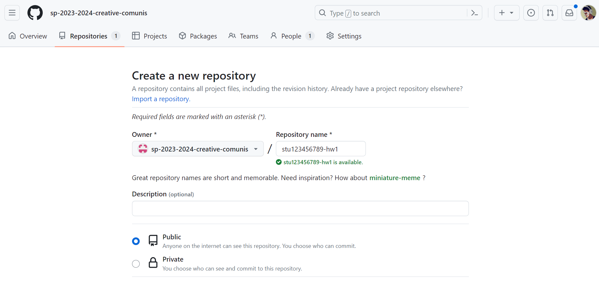

Резултата е отделно репозитори, в което ще бъде качено решението по начин описан в съмото условие. 

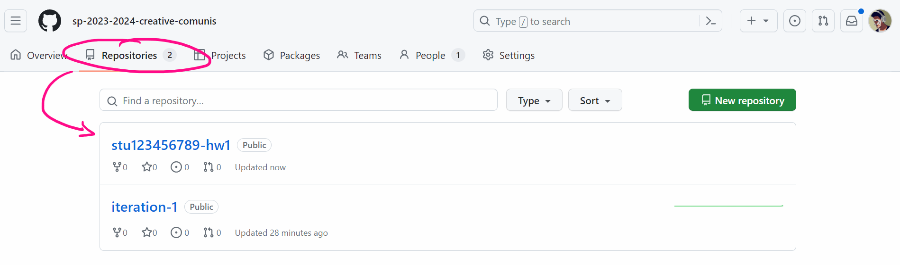

## Заключение
Ако всички тези обяснения, са накарали главата ви да изпитва болка и странна пулсация, спокойно - ще ви бъде напомняно 1000 кратно как да извършите всички тези процеси. Не забравяйте тук сме да се учим и да растем заедно, така че винаги ще получите насока в една или друга посока, когато се налага. 